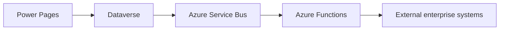

# Matthew Brunsdon

Senior developer specialising in **Dynamics 365, Power Platform, Power Pages and Azure integration architectures**.

I design and build enterprise systems that expose **Dataverse and Dynamics 365 data through secure portals, APIs and event-driven cloud architectures**.

Currently delivering Dynamics solutions in government environments and building reusable resources for the Power Platform developer community.

---

## Technologies

---

# Focus Areas

• **Power Pages portal architecture**  
• **Dynamics 365 / Dataverse development**  
• **Power Platform integrations**  
• **Azure event-driven architectures**  
• **Enterprise CRM and government systems**

---

# Featured Repositories

### Power Platform

- **power-pages-cheat-sheet**  
  Practical guidance for developers building portals with Power Pages and Dataverse.

- **dynamics365-developer-cheat-sheet**  
  Quick reference for Dynamics 365 development including plugins, Web API and solution management.

- **power-platform-integration-patterns**  
  Architecture patterns for integrating Power Platform with Azure services and external systems.

---

### Dataverse

- **dataverse-query-examples**  
  Practical Dataverse Web API query examples including filtering, expands and CRUD operations.

- **dataverse-schema-design-guide**  
  Guidance for designing scalable Dataverse schemas for Dynamics and Power Platform systems.

---

# Architecture Interests

I am particularly interested in architectures combining:

---

# Current Focus

Building resources and tools for developers working with:

- Power Pages
- Dataverse
- Dynamics 365
- Power Platform integration architectures

---

# Availability

Open to **remote contract engagements** involving:

• Dynamics 365  
• Power Platform  
• Power Pages portals  
• Dataverse integrations  
• Azure-based architectures